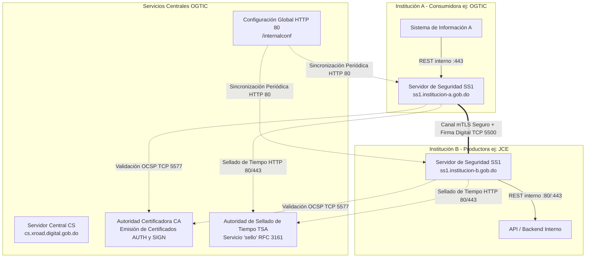
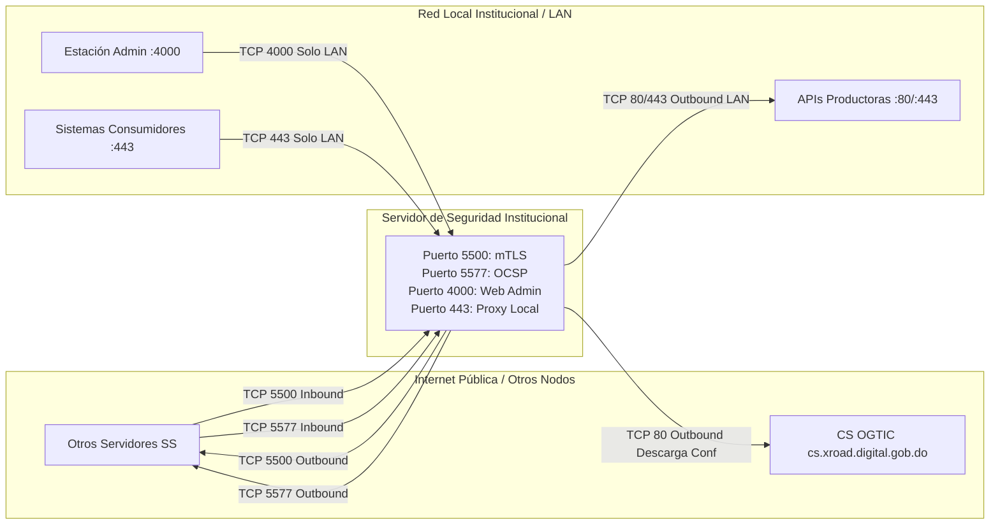
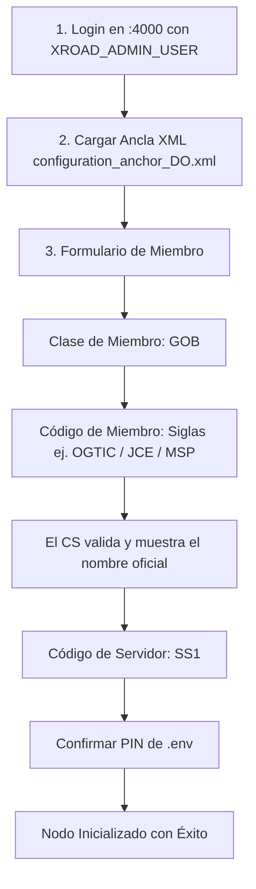
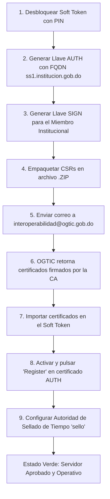

# Plataforma Única de Interoperabilidad del Estado Dominicano (PUI)
### Repositorio Oficial y Guía para Instituciones Miembros de X-Road

Bienvenido a la documentación oficial para la integración técnica, instalación, configuración y operación de nodos en la **Plataforma Única de Interoperabilidad (PUI)** del Estado Dominicano, coordinada y administrada por la **Oficina Gubernamental de Tecnologías de la Información y Comunicación (OGTIC)**.

---

### Índice de Contenidos

1. 🏛️ [Introducción a X-Road y la Plataforma Única de Interoperabilidad](#1-introducción-a-x-road-y-la-pui)
2. 🛡️ [Arquitectura y Flujo de Comunicación](#2-arquitectura-y-flujo-de-comunicación)
3. 📖 [Términos y Abreviaciones Clave](#3-términos-y-abreviaciones-clave)
4. 📋 [Requisitos de Infraestructura y Red](#4-requisitos-de-infraestructura-y-red)
5. 🌐 [Matriz de Puertos y Firewall](#5-matriz-de-puertos-y-firewall)
6. 👷‍♂️ [Instalación del Servidor de Seguridad (Docker Sidecar)](#6-instalación-del-servidor-de-seguridad)
7. 🧰 [Configuración Inicial e Inscripción de Miembro](#7-configuración-inicial-e-inscripción-de-miembro)
8. 🔐 [Gestión de Llaves Criptográficas y Certificados](#8-gestión-de-llaves-criptográficas-y-certificados)
9. 🧩 [Creación y Registro de Subsistemas](#9-creación-y-registro-de-subsistemas)
10. ✍️ [Publicación de Servicios REST (Productor)](#10-publicación-de-servicios-rest-productor)
11. 🤝 [Control de Acceso y Permisos (ACL)](#11-control-de-acceso-y-permisos-acl)
12. 🌐 [Consumo de Servicios entre Instituciones (Consumidor)](#12-consumo-de-servicios-entre-instituciones-consumidor)
13. ❓ [Preguntas Frecuentes](#13-preguntas-frecuentes)
14. 🩺 [Diagnóstico y Solución de Errores](#14-diagnóstico-y-solución-de-errores)
15. 🧹 [Desinstalación](#15-desinstalación)

---

## 1. Introducción a X-Road y la PUI

**X-Road** es un marco de interoperabilidad distribuido diseñado para permitir la comunicación segura, estandarizada y legalmente vinculante entre sistemas heterogéneos de instituciones públicas y privadas.

En la República Dominicana, la **OGTIC** opera la instancia nacional oficial (`DO`), permitiendo que las entidades intercambien datos de manera directa y cifrada, sin depender de intermediarios centralizados que retengan información sensible de los ciudadanos.

### Principios Fundamentales:
* **Intercambio Punto a Punto Cifrado (mTLS):** Los datos viajan cifrados directamente entre la entidad que los produce y la que los consume.
* **Firmas Digitales y No Repudio:** Cada transacción es firmada digitalmente a nivel de aplicación con certificados institucionales válidos y respaldada con un sello de tiempo legal (RFC 3161).
* **Control Soberano de Acceso:** Cada institución productora decide autónomamente qué instituciones y subsistemas tienen autorización para consultar sus datos.

---

## 2. Arquitectura y Flujo de Comunicación

El siguiente diagrama ilustra la interacción entre los componentes centrales operados por **OGTIC** y los **Servidores de Seguridad** instalados en cada institución:



---

## 3. Términos y Abreviaciones Clave

| Término | Definición Oficial |
| :--- | :--- |
| **CS (Central Server)** | Servidor Central administrado por OGTIC. Mantiene el catálogo de miembros, servidores de seguridad y la configuración global de seguridad. |
| **SS (Security Server)** | Servidor de Seguridad. Gateway que cada miembro despliega en su infraestructura para cifrar, firmar, registrar y enrutar las peticiones. |
| **CA (Certification Authority)** | Autoridad Certificadora. Emite certificados de autenticación (para el SS) y certificados de firma (para el miembro). |
| **TSA (Timestamping Authority)** | Autoridad de Sellado de Tiempo. Certifica la existencia temporal de cada mensaje mediante estampas de tiempo seguras. |
| **CSR (Certificate Signing Request)** | Solicitud formal de firma de certificado generada por el Servidor de Seguridad para ser remitida a OGTIC. |
| **OCSP** | Protocolo en línea para consultar y compartir la validez y vigencia de certificados digitales en tiempo real. |
| **Soft Token** | Almacén criptográfico por software protegido por PIN dentro del Servidor de Seguridad. |
| **Ancla de Configuración** | Archivo XML firmado por el CS que contiene los parámetros de confianza iniciales para que el SS se conecte a la red nacional. |

---

## 4. Requisitos de Infraestructura y Red

Antes de iniciar la instalación, debe asegurarse de contar con los siguientes requisitos:

* **Sistema Operativo:** Servidor virtual o dedicado con **Ubuntu 22.04 LTS (Jammy)** x86_64.
* **Capacidad de Hardware:**
  * **CPU:** 2 a 4 vCPU.
  * **Memoria RAM:** 3 a 4 GB RAM (mínimo 15 GB si se habilitan complementos avanzados de analítica/opmonitoring).
  * **Almacenamiento:** Mínimo 20 GB SSD (se recomiendan 40+ GB para retención de bitácoras de auditoría).
* **Identidad de Red:**
  * **Subdominio público:** `ss1.<dominio-institucion>.gob.do` (ejemplo: `ss1.ogtic.gob.do`).
  * **Dirección IP pública dedicada y exclusiva:** Requerida para la verificación estricta mTLS en el Servidor Central.
  * **Zona horaria configurada:**
    ```bash
    sudo timedatectl set-timezone America/Santo_Domingo
    ```
* **Usuario del Sistema:**
  > **IMPORTANTE:** Nunca utilice el nombre de usuario **`xroad`** para administrar el servidor. Es un usuario reservado por el sistema y provocará conflictos con los servicios internos.

---

## 5. Matriz de Puertos y Firewall



### Puertos de Entrada desde Internet (Red Externa hacia SS)
* **`TCP 5500`**: Intercambio de mensajes e interoperabilidad mTLS entre servidores de seguridad.
* **`TCP 5577`**: Consultas y respuestas OCSP entre servidores de seguridad.

### Puertos de Salida hacia Internet (SS hacia Red Externa)
* **`TCP 5500`**: Envío de peticiones a otros servidores de seguridad.
* **`TCP 5577`**: Consultas OCSP a servidores de seguridad externos.
* **`TCP 80`**: Descarga obligatoria de la configuración global desde `http://cs.xroad.digital.gob.do/internalconf`.
* **`TCP 4001`**: Conexión de comandos de gestión con el Servidor Central.
* **`TCP 80, 443`**: Acceso a servicios de sellado de tiempo (TSA) y CAs.

### Puertos de la Red Interna (LAN Institucional)
* **`TCP 4000`**: Consola web y API de gestión. **¡ESTRICTAMENTE PROHIBIDO EXPONERLO A INTERNET!**
* **`TCP 443` (o `8443`)**: Punto de acceso local para que sus sistemas de información consuman servicios (`/r1/...`).
* **`TCP 80, 443 u otros`**: Puertos internos donde residen sus APIs y microservicios productores de datos.

---

## 6. Instalación del Servidor de Seguridad

Aprovechamos la tecnología de contenedores para realizar el despliegue del servidor de seguridad mediante la imagen oficial **`niis/xroad-security-server-sidecar:7.8.2`**.

### Paso 1: Instalar Docker y Docker Compose
```bash
sudo snap install docker
```
*(O utilice los paquetes oficiales de Docker desde el repositorio APT).*

### Paso 2: Clonar el Repositorio de Miembros
```bash
git clone https://github.com/ogticrd/xroad-members.git
cd xroad-members
```

### Paso 3: Configurar Variables de Entorno (`.env`)
Genere su archivo de configuración copiando la plantilla:
```bash
cp .env.example .env
nano .env
```

Ajuste los valores de seguridad obligatorios:
```ini
# PIN maestro para desbloquear el almacén de llaves Soft Token (mínimo 6 caracteres)
XROAD_TOKEN_PIN=MiClaveTokenSegura2026!

# Usuario administrador de la consola web (¡NO USAR "xroad"!)
XROAD_ADMIN_USER=adminpui

# Contraseña del usuario administrador web
XROAD_ADMIN_PASSWORD=MiContrasenaFuerte2026#

# Nivel de bitácora
XROAD_LOG_LEVEL=INFO
```

### Paso 4: Levantar el Servicio
```bash
sudo docker-compose up -d
```
*(O `sudo docker compose up -d`).*

Verifique que el contenedor esté corriendo:
```bash
sudo docker ps
sudo docker-compose logs -f ss
```

Una vez levantado, ingrese desde un navegador dentro de su red local a:
```text
https://<subdominio-o-ip>:4000
```
*(Acepte la advertencia de certificado autofirmado inicial en el navegador).*

---

## 7. Configuración Inicial e Inscripción de Miembro

El proceso de inicialización vincula su nodo al catálogo central de la República Dominicana:



1. **Iniciar Sesión:** Acceda a `https://<subdominio>:4000` con `XROAD_ADMIN_USER` y `XROAD_ADMIN_PASSWORD`.
2. **Subir Ancla de Configuración:** 
   * Haga clic en examinar y suba el archivo `configuration_anchor_DO_internal_UTC_2023-06-13_22_02_45.xml` provisto en este repositorio.
   * *Nota:* Si la pantalla se queda cargando de manera indefinida, confirme que el servidor tenga salida a Internet hacia `http://cs.xroad.digital.gob.do` por el puerto TCP 80.
3. **Completar Formulario de Miembro:**
   * **Clase de miembro:** Seleccione **`GOB`** (entidades gubernamentales) o `COM`.
   * **Código de miembro:** Ingrese las siglas oficiales de su institución (ej: `OGTIC`, `JCE`, `MSP`). Si están correctas, el nombre oficial completo aparecerá automáticamente en la parte superior.
   * **Código del servidor de seguridad:** Ingrese **`SS1`** (o `SS2` para nodos secundarios).
   * **PIN:** Ingrese el mismo valor asignado a `XROAD_TOKEN_PIN` en su archivo `.env` en ambos campos de confirmación.

---

## 8. Gestión de Llaves Criptográficas y Certificados

Para que su servidor sea reconocido por los demás miembros, debe generar y registrar dos pares de llaves en su **Soft Token**:



### Paso a Paso Criptográfico:

1. **Desbloquear el Token:** En el panel principal, haga clic en el botón **"Log in"** a la derecha del *Soft Token* e introduzca su PIN.
2. **Generar Llave de Autenticación (`AUTH`):**
   * Vaya a **Keys and certificates** -> Despliegue el Token -> Haga clic en **"Add Key"**.
   * Label: `AUTH` -> Usage: **`Authentication`** -> Server DNS Name: `ss1.tu-institucion.gob.do` -> Country Code: `DO`.
   * Presione **"Generate CSR"** y descargue el archivo de solicitud.
3. **Generar Llave de Firma (`SIGN`):**
   * En el mismo Token, haga clic en **"Add Key"**.
   * Label: `SIGN` -> Usage: **`Signing`** -> Client: Seleccione su institución -> Country Code: `DO`.
   * Presione **"Generate CSR"** y descargue el segundo archivo.
4. **Enviar Solicitud a OGTIC:**
   * Cree un archivo comprimido `.zip` con los dos archivos CSR generados.
   * Remítalo por correo a:
     * **Para:** `interoperabilidad@ogtic.gob.do`
     * **Copia:** `kevin.jimenez@ogtic.gob.do`
     * **Asunto:** `[SOLICITUD CERTIFICADOS PUI] - <SIGLAS DE SU INSTITUCIÓN> - SS1`
5. **Importar Certificados:**
   * Al recibir los certificados firmados desde OGTIC, ingrese a **Keys and certificates**, presione **"Import"** y suba los archivos. El sistema auto-asociará cada certificado a su llave correspondiente.
6. **Activar y Registrar el Servidor:**
   * Seleccione el certificado de autenticación (`AUTH`) y presione **"Activate"**.
   * Presione **"Register"**, confirme el subdominio (`ss1.institucion.gob.do`) y envíe la solicitud al Servidor Central. El operador de OGTIC aprobará el nodo, quedando en estado verde **"Registered"**.
7. **Configurar Servicio de Sellado de Tiempo (TSA):**
   * En **Ajustes del Sistema (System Parameters)** -> **Timestamping Services** -> Presione **"Add"**.
   * Seleccione el servicio oficial disponible (**`sello`**) y confirme con **OK**.

---

## 9. Creación y Registro de Subsistemas

Un **subsistema** agrupa servicios, identifica proyectos en la red y permite otorgar o recibir permisos de manera aislada.

### Reglas Estrictas de Nomenclatura:
* ✅ **Estrictamente en MAYÚSCULAS** (Ej: `VALIDADOR`, `NOMINA`, `CONSULTA_PADRON`).
* ✅ **Descriptivo del proyecto específico.**
* ✅ **Sin espacios ni caracteres especiales** (prohibido `*&#$)(][@!`).
* 🚫 **PROHIBIDO:** Nombres de entorno (`PRODUCCION`, `PRUEBA`, `TEST`, `PROD`, `QA`) o nombres genéricos (`API`, `DATOS`, `DATA`, `INFO`, `INFORMACION`). *De usarse, serán rechazados de inmediato por el operador del Servidor Central.*

### Creación:
1. Ingrese a la pestaña **"Clients"**.
2. En la fila de su institución, haga clic en **"Add subsystem"**.
3. Complete **Subsystem Code** respetando las normas.
4. **Mantenga marcada la casilla para registrar el subsistema en el Servidor Central.**
5. Presione **"Add subsystem"** y espere la aprobación del operador.

---

## 10. Publicación de Servicios REST (Productor)

1. En la pestaña **"Clients"**, haga clic sobre el subsistema dueño del servicio.
2. Vaya al submenú **"Services"** y presione **"Add REST"**.
3. Seleccione **"REST API Base Path"**.
4. Ingrese la URL interna de su API backend (ejemplo: `http://192.168.1.50:8080/api/v1`).
5. Asigne un código de servicio en mayúsculas (ejemplo: `EMPLEADOS`).
6. Presione **"Add"**.
7. **Active el switch a la derecha del servicio para habilitarlo** (por defecto se crea desactivado).

---

## 11. Control de Acceso y Permisos (ACL)

Por defecto, ningún miembro externo puede consultar sus servicios sin autorización explícita:

1. Ingrese al subsistema productor y vaya a **"Service clients"**.
2. Haga clic en **"Add subject"**.
3. Busque la institución y el subsistema que solicita acceso (ej: `DO / GOB / MSP / VALIDADOR_VACUNAS`) y presione **Next**.
4. Seleccione el servicio (`EMPLEADOS`) al que desea otorgar permiso y presione **"Add Selected"**.

---

## 12. Consumo de Servicios entre Instituciones (Consumidor)

Para consultar un servicio remoto, **su petición debe enviarse a su propio Servidor de Seguridad local**:

```text
https://<IP_O_DOMINIO_SS_LOCAL>/r1/{CountryCode}/{MemberClass}/{MemberName}/{Service}/{Endpoint}
```

### Cabecera Obligatoria `X-Road-Client`:
Identifica el subsistema autorizado de su institución que realiza la solicitud:
```http
X-Road-Client: {CountryCode}/{MemberClass}/{SuInstitucion}/{SuSubsistema}
```

### Ejemplo Real:
```bash
curl -k -X GET \
  "https://127.0.0.1/r1/DO/GOB/OGTIC/EMPLEADOS/EjemploDeConsulta/40200000000" \
  -H "X-Road-Client: DO/GOB/OGTIC/VALIDADOR" \
  -H "Accept: application/json"
```

### Cabeceras de Respuesta:
* **`X-Road-Id`**: Identificador único de transacción. Confirma que la petición fue procesada y transportada exitosamente por la red X-Road.
* **`X-Road-Error`**: Si ocurre algún fallo de red, expiración de certificado o falta de permisos ACL, contendrá la descripción del error.

---

## 13. Preguntas Frecuentes

### ¿Qué tipo de información puedo intercambiar por X-Road?
Prácticamente cualquier tipo: JSON (REST), XML (SOAP), texto plano o binarios estructurados.

### ¿Se pueden transferir documentos (PDF, Word, Excel, imágenes)?
Sí. Se pueden enviar codificados en Base64 o como archivos adjuntos multiparte.

### Si envío documentos con firma digital previa, ¿se pierde o compromete dicha firma?
No. La información transita íntegra e intacta byte por byte. La firma digital original preserva todas sus propiedades jurídicas y técnicas.

### ¿Se pueden enviar archivos pesados (100 a 500 MB)?
Sí. El Servidor de Seguridad cuenta con el módulo `messagelog`. Para transferencias masivas continuas, se puede configurar para almacenar únicamente el resumen criptográfico (*digest*) y no el cuerpo completo del archivo en disco.

---

## 14. Diagnóstico y Solución de Errores

| Error o Síntoma | Causa Probable | Solución |
| :--- | :--- | :--- |
| **Carga infinita al subir ancla XML** | Sin salida al Servidor Central | Habilitar salida TCP 80 hacia `cs.xroad.digital.gob.do`. |
| **"Soft Token is locked"** | Contenedor reiniciado | Ingresar a `:4000` y pulsar "Log in" con el PIN del token. |
| **HTTP 403: `Client is not authorized`** | Falta permiso ACL | El productor debe agregar a su subsistema en `Service clients`. |
| **HTTP 404: `Unknown service`** | Servicio apagado o mal escrito | Confirmar código del servicio y que el switch esté activo en el productor. |
| **Timeout en puerto 5500** | Firewall bloqueando interoperabilidad | Abrir TCP 5500 bidireccional en la IP pública dedicada. |

---

## 15. Desinstalación

Para revertir completamente el despliegue técnico y purgar los volúmenes de datos, configuraciones y llaves:

```bash
cd xroad-members
sudo docker-compose down -v
```

> **Nota:** El modificador `-v` elimina de forma permanente los volúmenes `xroad_config`, `xroad_files` y la base de datos `xroad_db`.

---

### Canales de Soporte Técnico OGTIC
* **Mesa de Ayuda Interoperabilidad:** `interoperabilidad@ogtic.gob.do`
* **Coordinación Técnica:** `kevin.jimenez@ogtic.gob.do`
