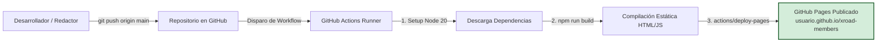

import useBaseUrl from '@docusaurus/useBaseUrl';

Este proyecto de documentación está preparado para publicarse de forma totalmente automatizada en **GitHub Pages** utilizando flujos de trabajo de **GitHub Actions (CI/CD)**.

---

## Arquitectura de Publicación CI/CD



---

## 1. Ajuste de Parámetros en `docusaurus.config.js`

Antes de hacer el push inicial a su repositorio personal o institucional en GitHub, abra el archivo `docusaurus.config.js` en la raíz del proyecto y configure los siguientes tres valores según su cuenta:

```javascript title="docusaurus.config.js"
  // Reemplace 'tu-usuario' con su nombre de usuario u organización en GitHub
  url: 'https://tu-usuario.github.io',
  
  // Si el repositorio se llama 'xroad-members', mantenga '/xroad-members/'
  // Si el repositorio es su página principal (tu-usuario.github.io), use '/'
  baseUrl: '/xroad-members/',

  // Su usuario u organización de GitHub
  organizationName: 'tu-usuario',

  // El nombre exacto de su repositorio en GitHub
  projectName: 'xroad-members',
  
  deploymentBranch: 'gh-pages',
  trailingSlash: false,
```

---

## 2. Flujo Automatizado de GitHub Actions (`deploy.yml`)

El proyecto incluye el archivo de flujo de trabajo en `.github/workflows/deploy.yml`:

```yaml title=".github/workflows/deploy.yml"
name: Despliegue en GitHub Pages

on:
  push:
    branches:
      - main
      - master
  workflow_dispatch:

permissions:
  contents: read
  pages: write
  id-token: write

concurrency:
  group: 'pages'
  cancel-in-progress: false

jobs:
  build:
    runs-on: ubuntu-latest
    steps:
      - name: Checkout del Repositorio
        uses: actions/checkout@v4

      - name: Configurar Node.js 20
        uses: actions/setup-node@v4
        with:
          node-version: 20
          cache: npm

      - name: Instalar Dependencias
        run: npm ci || npm install

      - name: Compilar Sitio Docusaurus
        run: npm run build

      - name: Subir Artefacto para Pages
        uses: actions/upload-pages-artifact@v3
        with:
          path: build

  deploy:
    environment:
      name: github-pages
      url: ${{ steps.deployment.outputs.page_url }}
    runs-on: ubuntu-latest
    needs: build
    steps:
      - name: Publicar en GitHub Pages
        id: deployment
        uses: actions/deploy-pages@v4
```

---

## 3. Activación de GitHub Pages en su Repositorio

Para que GitHub ejecute el despliegue automático:

1. Ingrese a su repositorio en GitHub en el navegador.
2. Vaya a la pestaña **Settings** (Configuración del repositorio).
3. En el menú lateral izquierdo, seleccione **Pages**.
4. En la sección **"Build and deployment"** -> **Source**:
   * Cambie la opción de *Deploy from a branch* a **GitHub Actions**:
5. Cada vez que realice un `git push` a la rama `main` o `master`, la pestaña **Actions** compilará el sitio y lo publicará en segundos.

---

## 4. Comandos para Probar Localmente

Puede probar el sitio de documentación localmente en su máquina con los siguientes comandos:

```bash
# Instalar paquetes
npm install

# Iniciar servidor de desarrollo en vivo con recarga rápida
npm start

# Compilar para producción localmente y verificar enlaces rotos
npm run build

# Servir los archivos compilados en local
npm run serve
```
