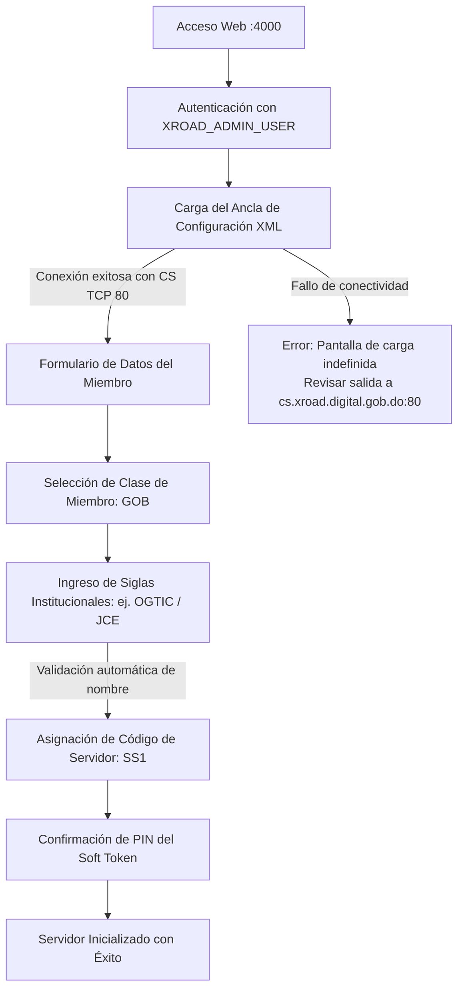

import useBaseUrl from '@docusaurus/useBaseUrl';

Una vez desplegado y en ejecución el contenedor del Servidor de Seguridad, el siguiente paso es realizar la **inicialización lógica del nodo** y su vinculación formal con el Servidor Central de la República Dominicana.

---

## Flujo del Proceso de Inicialización



---

## Paso 1: Acceso a la Consola de Administración

Abra su navegador web e ingrese a la dirección configurada en el puerto 4000:

```text
https://ss1.tu-institucion.gob.do:4000
```

Se presentará la pantalla de inicio de sesión:

<div style={{textAlign: 'center', margin: '1.5rem 0'}}>
  
  <p><em>Figura 2: Pantalla de inicio de sesión institucional.</em></p>
</div>

* **Username:** El valor configurado en `XROAD_ADMIN_USER` dentro del archivo `.env` (ej: `adminpui`).
* **Password:** El valor configurado en `XROAD_ADMIN_PASSWORD` dentro del archivo `.env`.

---

## Paso 2: Carga del Ancla de Configuración (Configuration Anchor)

Al iniciar sesión por primera vez, el sistema detecta que es una instalación nueva y solicita el archivo **Ancla de Configuración**:

<div style={{textAlign: 'center', margin: '1.5rem 0'}}>
  
  <p><em>Figura 3: Asistente de carga de ancla de configuración.</em></p>
</div>

1. Haga clic en **Examinar / Seleccionar archivo**.
2. Seleccione el archivo oficial suministrado en el repositorio:
   * Nombre de archivo: `configuration_anchor_DO_internal_UTC_2023-06-13_22_02_45.xml`
   * [📥 Descargar Ancla Oficial DO XML](pathname:///files/configuration_anchor_DO_internal_UTC_2023-06-13_22_02_45.xml)

<div style={{textAlign: 'center', margin: '1.5rem 0'}}>
  
  <p><em>Figura 4: Confirmación del archivo de ancla seleccionado.</em></p>
</div>

3. Haga clic en **Confirmar / Subir archivo**.

:::warning ¿Qué hacer si la pantalla se queda cargando indefinidamente?
Si tras confirmar el ancla la pantalla muestra un indicador de carga permanente y no avanza, se debe a una **falta de comunicación entre su servidor y el Servidor Central**. 
Su servidor intenta conectarse inmediatamente a `http://cs.xroad.digital.gob.do/internalconf` por el **puerto TCP 80** para validar el ancla y descargar las políticas.
Verifique desde la consola de su servidor:
```bash
curl -I http://cs.xroad.digital.gob.do/internalconf
```
Si la consulta falla o se agota el tiempo de espera, revise las reglas de firewall saliente de su institución.
:::

---

## Paso 3: Completar Datos del Miembro y Servidor

Una vez validada el ancla, el asistente desplegará el formulario de identificación institucional:

<div style={{textAlign: 'center', margin: '1.5rem 0'}}>
  
  <p><em>Figura 5: Formulario de datos del miembro y PIN del Soft Token.</em></p>
</div>

Complete cada campo según la siguiente guía:

| Campo | Valor Requerido | Descripción y Buenas Prácticas |
| :--- | :--- | :--- |
| **Clase de Miembro (Member Class)** | `GOB` | Seleccione `GOB` para entidades públicas y ministerios del Estado Dominicano. |
| **Código de Miembro (Member Code)** | Siglas oficiales (ej: `OGTIC`, `JCE`, `MSP`) | Ingrese las siglas oficiales registradas en el Servidor Central. **Si están correctas, el nombre oficial completo de la institución aparecerá automáticamente** arriba del campo. Si el nombre no aparece, contacte a `interoperabilidad@ogtic.gob.do`. |
| **Código de Servidor (Security Server Code)** | `SS1` | Código identificador del nodo. Para el nodo principal se utiliza `SS1`. Para contingencia: `SS2`, `SS3`. |
| **PIN** | Mismo PIN de `.env` | Debe coincidir exactamente con el valor definido en `XROAD_TOKEN_PIN` en su archivo de configuración `.env`. |
| **Repita PIN** | Confirmación idéntica | Confirme el PIN ingresado. |

:::danger Importancia Crítica del PIN
El PIN ingresado inicializa el almacén criptográfico del sistema. Si ingresa un PIN distinto al configurado en la variable `XROAD_TOKEN_PIN` del archivo `.env`, el servicio no podrá desbloquear automáticamente el Soft Token tras futuros reinicios del contenedor.
:::

---

## Paso 4: Finalización de la Inicialización

Haga clic en **Continuar / Submit**. El sistema inicializará la base de datos interna y desplegará un mensaje de confirmación:

<div style={{textAlign: 'center', margin: '1.5rem 0'}}>
  
  <p><em>Figura 6: Panel general tras inicialización exitosa.</em></p>
</div>

El nodo ha completado su fase inicial. Continúe inmediatamente a la sección [4.2 Llaves y Certificados](/configuracion/llaves-y-certificados) para desbloquear el token y generar las solicitudes de firma (CSR).
