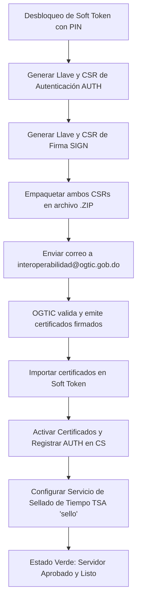

import useBaseUrl from '@docusaurus/useBaseUrl';

Para que el Servidor de Seguridad pueda comunicarse de manera confiable con los demás miembros del Estado Dominicano, debe poseer dos pares de llaves y certificados digitales válidos:
1. **Certificado de Autenticación (`AUTH`):** Vinculado al nombre de dominio DNS del servidor para proteger la conexión mTLS.
2. **Certificado de Firma (`SIGN`):** Vinculado a la persona jurídica (la institución) para firmar digitalmente cada mensaje.

---

## Flujo del Proceso Criptográfico



---

## Paso 1: Desbloqueo del Soft Token

Al ingresar al panel, notará una barra de alerta en color rojo en la parte superior:

<div style={{textAlign: 'center', margin: '1.5rem 0'}}>
  
  <p><em>Figura 7: Alerta indicando que el Soft Token requiere ingreso de PIN.</em></p>
</div>

1. Haga clic en el botón **Log in / Ingrese PIN** a la derecha del Soft Token.
2. Ingrese el PIN de seguridad definido durante la instalación (`XROAD_TOKEN_PIN`) y presione **OK**.
3. El estado del token cambiará a **Log out**, lo que confirma que el almacén de llaves se encuentra abierto y listo para operar.

---

## Paso 2: Generación de la Llave de Autenticación (`AUTH`)

1. Diríjase a la sección **"Keys and certificates" (Llaves y certificados)** en el menú lateral izquierdo:

<div style={{textAlign: 'center', margin: '1.5rem 0'}}>
  
  <p><em>Figura 8: Almacén de llaves Soft Token listo para agregar llaves.</em></p>
</div>

2. Despliegue el Soft Token haciendo clic en la flecha izquierda y presione **"Add Key"**:
   * **Key Label:** Asigne una etiqueta descriptiva, por ejemplo: `AUTH` o `LLAVE_AUTENTICACION`. Presione **Next**.
   * **Usage:** Seleccione estrictamente **`Authentication`**. Presione **Continue**.
   * **Server DNS Name:** Ingrese el subdominio público completo del servidor, por ejemplo: `ss1.institucion.gob.do`.
   * **Country Code:** Ingrese `DO`.
3. Haga clic en **"Generate CSR"** para descargar el archivo de solicitud de certificado en formato `.pem` o `.der`.
4. Haga clic en **"Done"**.

---

## Paso 3: Generación de la Llave de Firma (`SIGN`)

1. Dentro del mismo Soft Token, haga clic nuevamente en el botón **"Add Key"**:
   * **Key Label:** Asigne una etiqueta descriptiva, por ejemplo: `SIGN` o `LLAVE_FIRMA`. Presione **Next**.
   * **Usage:** Seleccione estrictamente **`Signing`**.
   * **Client:** Seleccione el miembro institucional correspondiente (será la única opción desplegada en la lista). Presione **Continue**.
   * **Country Code:** Ingrese `DO`.
2. Haga clic en **"Generate CSR"** para descargar el segundo archivo de solicitud de certificado.
3. Haga clic en **"Done"**.

---

## Paso 4: Solicitud Formal de Firma ante OGTIC

1. Agrupe los dos archivos CSR generados en un único archivo comprimido:
   ```text
   certificados_ss1_institucion.zip
   ├── ss1_institucion_auth.csr
   └── ss1_institucion_sign.csr
   ```
2. Redacte un correo formal dirigido a:
   * **Destinatario principal:** `interoperabilidad@ogtic.gob.do`
   * **Con copia:** `kevin.jimenez@ogtic.gob.do`
   * **Asunto:** `[SOLICITUD CERTIFICADOS PUI] - <Siglas de su Institución> - SS1`
   * **Cuerpo del mensaje:** Indique el nombre oficial de la institución, el subdominio público del servidor (`ss1.institucion.gob.do`), la dirección IP pública dedicada y adjunte el archivo `.zip`.
3. Espere la confirmación y el retorno de los certificados firmados por la Autoridad Certificadora (CA) de la PUI.

---

## Paso 5: Importación de Certificados Firmados

Una vez reciba los certificados firmados desde OGTIC:

1. Ingrese a la consola web en **"Keys and certificates"**.
2. Haga clic en el botón **"Import"** ubicado en la parte superior:

<div style={{textAlign: 'center', margin: '1.5rem 0'}}>
  
  <p><em>Figura 9: Selección e importación de los certificados retornados por OGTIC.</em></p>
</div>

3. Seleccione el certificado correspondiente. El sistema de X-Road detectará automáticamente el tipo de certificado (Autenticación o Firma) y lo vinculará a la llave privada correspondiente.
4. Repita la importación para el segundo certificado.

---

## Paso 6: Activación y Registro del Servidor en el Servidor Central

1. Localice el **Certificado de Autenticación (`AUTH`)** importado en la lista.
2. Haga clic en el botón **"Activate" (Activar)**.
3. Con el certificado activo, haga clic en el botón **"Register" (Registrar)**:
   * En la ventana emergente, ingrese o confirme el subdominio público del servidor (`ss1.institucion.gob.do`).
   * Haga clic en **Submit**.
4. En este momento, su servidor envía una solicitud de registro telemática al Servidor Central. Un operador de OGTIC validará que el subdominio y la IP correspondan al miembro y procederá con la aprobación.
5. Al aprobarse el registro, el estado del certificado cambiará al estado **"Registered"** con un indicador verde:

<div style={{textAlign: 'center', margin: '1.5rem 0'}}>
  
  <p><em>Figura 10: Certificado de autenticación registrado y validado en toda la red PUI.</em></p>
</div>

---

## Paso 7: Configuración de la Autoridad de Sellado de Tiempo (TSA)

Para que los mensajes puedan ser sellados de acuerdo con la política legal del Estado Dominicano:

1. Diríjase a **"Parámetros del Sistema" (System Parameters)** en el menú lateral:

<div style={{textAlign: 'center', margin: '1.5rem 0'}}>
  
  <p><em>Figura 11: Parámetros del sistema y sección Timestamping Services.</em></p>
</div>

2. En la sección **"Timestamping Services"**, haga clic en **"AGREGAR" (Add)**:

<div style={{textAlign: 'center', margin: '1.5rem 0'}}>
  
  <p><em>Figura 12: Ventana de selección de autoridad de sellado de tiempo.</em></p>
</div>

3. En el desplegable, seleccione el servicio oficial provisto por la red nacional (generalmente denominado **`sello`**):
4. Presione **OK** para confirmar. La URL del servicio quedará registrada y activa.

¡Felicitaciones! Su Servidor de Seguridad se encuentra plenamente operativo, registrado y certificado. Continúe a la sección [5.1 Gestión de Subsistemas](/subsistemas/gestion-y-convenciones).
