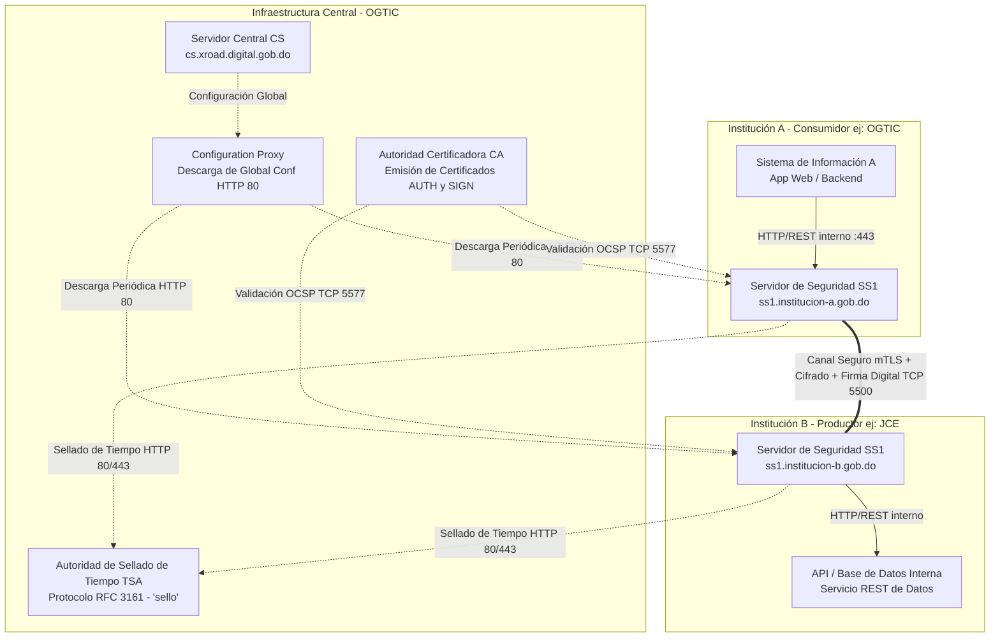
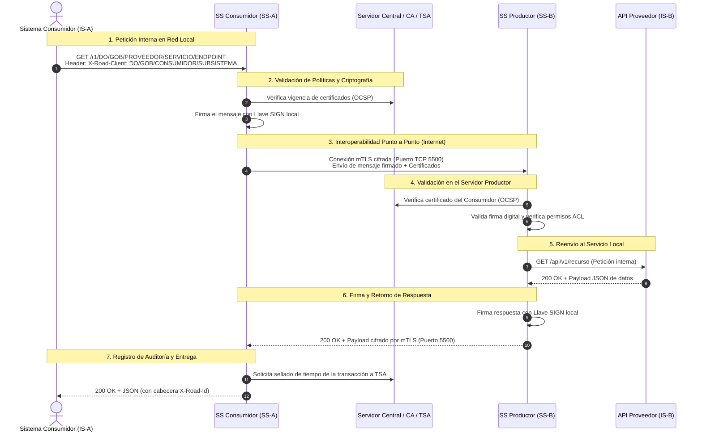

import useBaseUrl from '@docusaurus/useBaseUrl';

La arquitectura de la Plataforma Única de Interoperabilidad (PUI) implementa un modelo **federado y distribuido**, donde la seguridad no depende de intermediarios centralizados que lean el contenido de los mensajes, sino de la criptografía de extremo a extremo gestionada por los **Servidores de Seguridad (Security Servers)** de cada miembro.

---

## Diagrama de Arquitectura Oficial

  
  
<em>Figura 1: Topología general de comunicación entre entidades y componentes centrales.</em>

---

## Diagrama de Interacción entre Componentes

El siguiente diagrama detalla cómo interactúan los componentes centrales y los nodos de las instituciones:

---

## Componentes del Ecosistema

### 1. Servidor Central (Central Server - CS)
* **Función:** Es el núcleo de gobernanza y configuración administrado por OGTIC.
* **Responsabilidades:**
  * Almacena el registro único de todos los miembros autorizados del Estado Dominicano y sus códigos oficiales.
  * Mantiene la lista de Servidores de Seguridad válidos y sus nombres DNS públicos.
  * Publica la lista de Autoridades Certificadoras (CA) y Autoridades de Sellado de Tiempo (TSA) de confianza.
  * Genera el archivo firmado de **Configuración Global** (`globalconf`) que todos los Servidores de Seguridad descargan periódicamente.

### 2. Servidores de Seguridad (Security Servers - SS)
* **Función:** Es el gateway criptográfico que cada institución miembro despliega y administra en su propia infraestructura.
* **Responsabilidades:**
  * **Autenticación mTLS:** Establece canales cifrados TLS mutuos con otros Servidores de Seguridad utilizando el certificado de autenticación (`AUTH`).
  * **Firma Digital de Mensajes:** Firma criptográficamente cada petición saliente y valida la firma de cada petición entrante utilizando el certificado de firma (`SIGN`).
  * **Sellado de Tiempo (Timestamping):** Envía resúmenes periódicos de los mensajes a la TSA para estampar la marca de tiempo legal.
  * **Bitácora de Auditoría (MessageLog):** Registra cada transacción de forma segura y no repudiable en su base de datos PostgreSQL local.
  * **Control de Acceso (ACL):** Permite o deniega el acceso a los servicios basándose en el identificador del subsistema consumidor.

### 3. Autoridad Certificadora (CA)
* **Función:** Emite y revoca los certificados digitales para los miembros:
  * **Certificados de Autenticación (AUTH):** Asociados al nombre de dominio DNS del Servidor de Seguridad.
  * **Certificados de Firma (SIGN):** Asociados a la persona jurídica (miembro institucional).
* **Protocolo OCSP:** Expone el protocolo de estado de certificados en línea para verificar en tiempo real si un certificado sigue siendo válido.

### 4. Autoridad de Sellado de Tiempo (TSA)
* **Función:** Emite estampas de tiempo digitales certificadas según el estándar RFC 3161.
* **Eficiencia por lotes:** Los Servidores de Seguridad aplican un algoritmo de sellado por lotes (*batch timestamping*), agrupando múltiples transacciones en un solo sello, lo que mantiene el rendimiento alto sin sobrecargar el servicio de la TSA.

---

## Flujo Secuencial de una Consulta entre Instituciones

El siguiente diagrama de secuencia describe el recorrido de un mensaje desde que un sistema consumidor solicita información hasta que el productor responde:

Continúe a la sección [1.3 Términos y Abreviaciones](/intro/glosario) para conocer el vocabulario técnico oficial.
