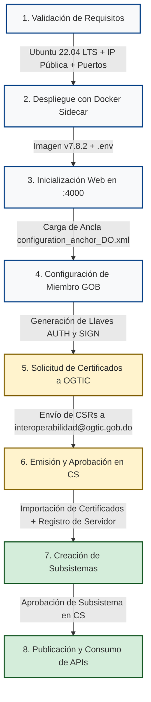

import useBaseUrl from '@docusaurus/useBaseUrl';

  
  <h2>Plataforma Única de Interoperabilidad del Estado Dominicano</h2>
  
<strong>Oficina Gubernamental de Tecnologías de la Información y Comunicación (OGTIC)</strong>

---

## ¿Qué es X-Road?

**X-Road** es un ecosistema y marco de interoperabilidad digital de código abierto, diseñado originalmente para permitir el intercambio seguro de datos entre sistemas de información distribuidos y heterogéneos, tanto en el sector gubernamental como en el empresarial. 

En la República Dominicana, la **Oficina Gubernamental de Tecnologías de la Información y Comunicación (OGTIC)** administra la **Plataforma Única de Interoperabilidad (PUI)**, utilizando X-Road como la columna vertebral tecnológica para la interconexión de todas las entidades públicas del Estado Dominicano (identificador de instancia oficial: `DO`).

:::tip Propósito de esta Documentación
Esta documentación está dirigida a los **equipos técnicos, administradores de infraestructura, desarrolladores y arquitectos de soluciones** de las instituciones miembros o aspirantes a miembros de la PUI. Aquí encontrará el ciclo completo de vida de su nodo: requisitos de red, despliegue con contenedores Docker, configuración criptográfica con tokens de seguridad, registro de subsistemas, publicación y consumo de servicios REST.
:::

---

## Principios Fundamentales del Ecosistema

La Plataforma Única de Interoperabilidad se basa en cuatro pilares de seguridad y soberanía de datos:

1. **Arquitectura Distribuida (Punto a Punto Seguro):**
   No existe un repositorio centralizado de datos de los ciudadanos. Los datos viajan directamente y de forma cifrada (mTLS) desde el Servidor de Seguridad de la institución que produce el dato hasta el Servidor de Seguridad de la institución que lo consume.

2. **No Repudio y Validez Jurídica:**
   Cada mensaje intercambiado es firmado digitalmente con un certificado institucional emitido por la Autoridad Certificadora (CA) de la PUI y estampado con un sello de tiempo emitido por una Autoridad de Sellado de Tiempo (TSA). Toda transacción deja una bitácora inalterable con valor probatorio legal.

3. **Autonomía y Control Institucional:**
   Cada institución mantiene el control estricto de sus propias bases de datos y servicios. Mediante listas de control de acceso (ACL), el proveedor decide con precisión granular qué institución y qué subsistema específico tiene permiso para consultar cada endpoint.

4. **Estandarización Semántica y de Protocolo:**
   Todas las consultas se uniformizan a través de protocolos web estándar (REST y SOAP), utilizando identificadores universales de clientes y servicios definidos a nivel nacional.

---

## Flujo Integral para Instituciones Miembros

El siguiente diagrama ilustra la ruta que debe recorrer cada entidad del Estado Dominicano para integrarse exitosamente a la PUI:

---

## Canales de Soporte y Contacto Oficial

Para gestiones de registro, aprobación de certificados, aprobación de subsistemas y soporte de conectividad con el Servidor Central:

| Entidad / Canal | Detalle / Destinatario | Propósito |
| :--- | :--- | :--- |
| **OGTIC - Interoperabilidad** | `interoperabilidad@ogtic.gob.do` | Canal principal para recepción de CSRs, soporte y altas de miembros. |
| **Coordinación Técnica** | `kevin.jimenez@ogtic.gob.do` | Soporte directo para firma de certificados y validación de servidores. |
| **Servidor Central (CS PUI)** | `http://cs.xroad.digital.gob.do/internalconf` | URL oficial de descarga de configuración global y ancla de confianza. |
| **Repositorios Oficiales** | [GitHub OGTIC - xroad-members](https://github.com/ogticrd/xroad-members) | Código fuente de referencia, docker-compose y ancla XML vigente. |

Continúe a la sección [1.2 Arquitectura Técnica](/intro/arquitectura) para conocer los componentes internos del sistema.
