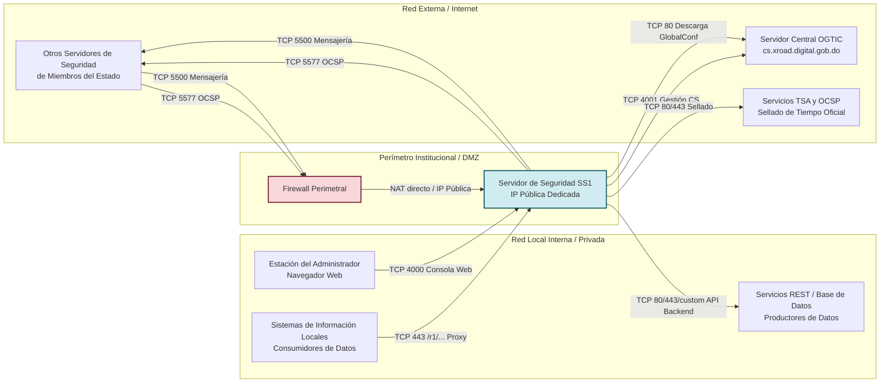

La comunicación en la red X-Road se divide estrictamente entre la **Red Externa (Internet / Interoperabilidad)** y la **Red Interna (LAN Institucional / Sistemas de Información)**.

---

## Topología de Red y Perímetro de Seguridad

El siguiente diagrama detalla la segmentación de red requerida para su Servidor de Seguridad:



---

## Matriz Exhaustiva de Puertos

### 1. Conexiones Entrantes desde la Red Externa (Internet hacia el Servidor)

Estos puertos deben abrirse en su firewall perimetral y dirigirse directamente a la IP del Servidor de Seguridad:

| Puerto | Protocolo | Servicio / Uso | Descripción |
| :--- | :--- | :--- | :--- |
| **`5500`** | **TCP** | Mensajería de Interoperabilidad | Intercambio de mensajes firmados y cifrados (mTLS) entre su servidor y los demás Servidores de Seguridad del Estado. |
| **`5577`** | **TCP** | Caché y Consultas OCSP | Protocolo de estado de certificados en línea entre servidores de seguridad para validación de vigencia en tiempo real. |

---

### 2. Conexiones Salientes hacia la Red Externa (Servidor hacia Internet)

El servidor debe contar con salida libre hacia Internet para los siguientes destinos y puertos:

| Puerto | Protocolo | Destino | Propósito |
| :--- | :--- | :--- | :--- |
| **`5500`** | **TCP** | Todos los SS del Estado | Envío de peticiones de interoperabilidad a otros miembros. |
| **`5577`** | **TCP** | Todos los SS del Estado | Consulta de estados de certificados OCSP a nodos externos. |
| **`80`** | **TCP** | `cs.xroad.digital.gob.do` | Descarga periódica obligatoria de la configuración global (`globalconf`) del Servidor Central. |
| **`4001`** | **TCP** | `cs.xroad.digital.gob.do` | Protocolo de sincronización y comandos de gestión con el Servidor Central. |
| **`80`**, **`443`** | **TCP** | Servidores de CA y TSA | Consulta directa de CRLs/OCSP y peticiones de sellado de tiempo criptográfico. |

---

### 3. Conexiones Entrantes desde la Red Interna (LAN hacia el Servidor)

:::danger ¡ALERTA DE SEGURIDAD ESTRICTA: PUERTO 4000!
El puerto **TCP 4000** es la interfaz gráfica de administración web y la API REST de configuración interna del Servidor de Seguridad.
**¡NUNCA DEBE SER ACCESIBLE DESDE INTERNET!** Debe restringirse exclusivamente a las direcciones IP de la red de gestión interna institucional mediante reglas de firewall local (iptables/ufw) o perimetral.
:::

| Puerto | Protocolo | Origen Permitido | Descripción |
| :--- | :--- | :--- | :--- |
| **`4000`** | **TCP** | LAN de Administración / VPN | Interfaz web de usuario y REST Management API del nodo. |
| **`443`** | **TCP** (o `8443`) | LAN / Servidores de Aplicación | Punto de entrada para que sus sistemas de información consuman servicios (`/r1/...`). |

---

### 4. Conexiones Salientes hacia la Red Interna (Servidor hacia la LAN)

| Puerto | Protocolo | Destino | Descripción |
| :--- | :--- | :--- | :--- |
| **`80`**, **`443`** *(o personalizado)* | **TCP** | Servidores de API Productora | Conexión HTTP/HTTPS hacia sus microservicios internos que proveen los datos para exponer en la red. |
| **`2080`** | **TCP** | Localhost (`127.0.0.1`) | Conexión interna para el agente de monitoreo de datos operativos. |

---

## Configuración de Reglas con UFW (Ubuntu)

Si utiliza el cortafuegos `ufw` en su servidor Ubuntu, puede aplicar las reglas básicas con los siguientes comandos:

```bash
# Permitir conexiones administrativas SSH solo desde su red interna
sudo ufw allow from 192.168.1.0/24 to any port 22 proto tcp

# Permitir interfaz de administración de X-Road solo desde la LAN
sudo ufw allow from 192.168.1.0/24 to any port 4000 proto tcp

# Permitir punto de acceso de consumo interno
sudo ufw allow from 192.168.0.0/16 to any port 443 proto tcp

# Permitir tráfico público de interoperabilidad desde cualquier IP pública
sudo ufw allow 5500/tcp comment "X-Road Interoperabilidad mTLS"
sudo ufw allow 5577/tcp comment "X-Road Consultas OCSP"

# Habilitar el cortafuegos
sudo ufw enable
sudo ufw status verbose
```

Continúe a la sección [3.1 Instalación con Docker Sidecar](/instalacion/docker-sidecar).
