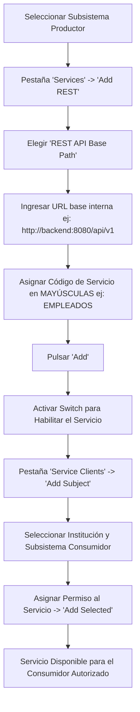

import useBaseUrl from '@docusaurus/useBaseUrl';

Cuando su institución actúa como **productora de datos**, sus APIs y servicios de backend se conectan a su Servidor de Seguridad para exponerlos a la red de forma segura, auditada y con control de acceso granular.

---

## Flujo del Productor de Servicios

---

## Paso 1: Configurar la API REST en el Servidor de Seguridad

1. Ingrese a la consola web (`:4000`) y diríjase a la sección **"Clients"**.
2. Haga clic sobre el **subsistema** que actuará como dueño del servicio (por ejemplo, `RECURSOS_HUMANOS`).
3. En el submenú horizontal del subsistema, seleccione la pestaña **"Services"** (Servicios).
4. Haga clic en el botón superior derecho **"Add REST"**.
5. Se abrirá un asistente de configuración:
   * **Tipo de Servicio:** Seleccione la opción **"REST API Base Path"**.
   * **URL Base de la API:** Ingrese la URL interna donde su microservicio o backend escucha peticiones en la red local (ejemplo: `http://192.168.10.25:8080/api/v1` o `https://api-interna.institucion.gob.do`).
   * **Service Code:** Ingrese un código en mayúsculas, descriptivo y sin espacios que identificará el servicio en la red (ejemplo: `EMPLEADOS`, `CONSULTA_PADRON`, `ESTADO_CUENTA`).
6. Haga clic en **"Add"**.

:::warning ¡El Servicio se Crea Inhabilitado por Defecto!
Por motivos de seguridad, todo nuevo servicio registrado en X-Road se crea inicialmente en estado desactivado.
Para permitir que responda a consultas:
* Localice el servicio recién creado en la lista.
* **Active el interruptor (switch)** ubicado en el extremo derecho de la fila para habilitarlo.
:::

---

## Paso 2: Otorgar Permisos de Acceso (Listas de Control de Acceso - ACL)

En X-Road rige el principio de **denegación por defecto (Zero Trust)**: ninguna institución puede consultar su API a menos que usted le otorgue permisos explícitos a través de su interfaz.

1. Dentro de la configuración del subsistema productor, haga clic en la pestaña **"Service clients"** (Clientes del servicio).
2. Haga clic en el botón **"Add subject"** (Agregar sujeto).
3. Busque y seleccione:
   * **Institución Miembro Consumidora:** (Ejemplo: `DO / GOB / MSP`).
   * **Subsistema Consumidor:** (Ejemplo: `VALIDADOR_VACUNAS`).
4. Haga clic en **"Next"**.
5. Seleccione los servicios o endpoints específicos a los que desea autorizar el acceso a dicho subsistema.
6. Haga clic en **"Add Selected"**.

A partir de este momento, cualquier petición originada por el subsistema `VALIDADOR_VACUNAS` de la institución consumidora hacia su endpoint será autenticada, validada criptográficamente por la red y reenviada exitosamente a su API interna.

---

## Monitoreo y Buenas Prácticas del Productor

* **Seguridad en la Red Local:** La comunicación entre su Servidor de Seguridad y su API backend se realiza en la red interna. Si transita por segmentos compartidos, configure TLS interno en el backend.
* **Manejo de Errores HTTP:** Si su API backend retorna códigos de error estándar (404, 400, 500), X-Road los transportará fielmente al consumidor, agregando cabeceras de trazabilidad.
* **Políticas de Timeout:** Puede ajustar los tiempos de espera de respuesta (*timeout*) en las propiedades avanzadas del servicio para evitar que peticiones lentas saturen los hilos de Jetty.

Continúe a la sección [6.2 Consumir Servicios](/servicios/consumir-servicios) para aprender cómo invocar servicios remotos como consumidor.
