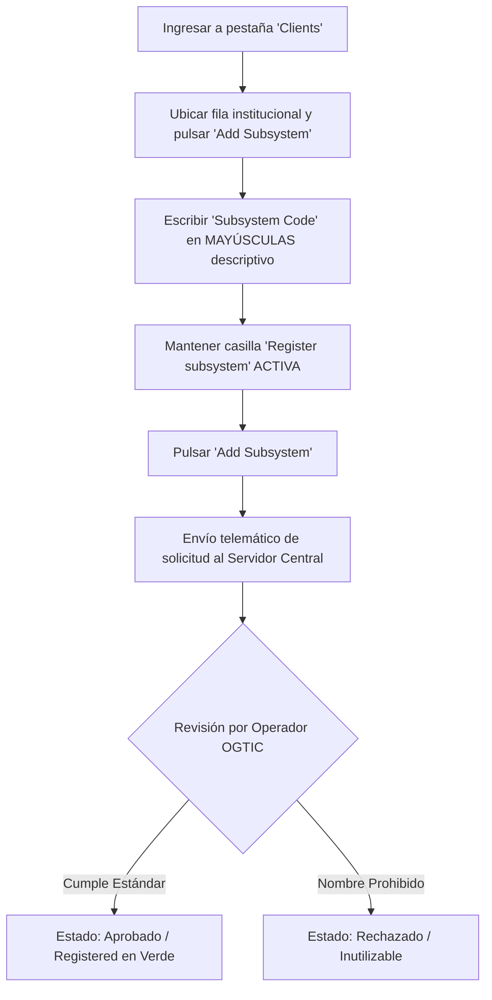

import useBaseUrl from '@docusaurus/useBaseUrl';

En el marco de **X-Road**, un **Subsistema (Subsystem)** es el mecanismo técnico y lógico utilizado para agrupar y organizar los servicios de intercambio de datos de una entidad.

---

## Importancia de los Subsistemas

Los subsistemas son un pilar central en la Plataforma Única de Interoperabilidad debido a que:
1. **Identifican proyectos específicos:** En lugar de otorgar acceso a toda la institución en bloque, los permisos se conceden exclusivamente al subsistema que gestiona un proyecto particular.
2. **Aislamiento de Seguridad:** Los derechos de acceso otorgados a un subsistema no afectan a los demás subsistemas de la misma entidad.
3. **Catálogo Nacional de Servicios:** Todos los miembros de la red pueden consultar los subsistemas registrados por las demás entidades en el Servidor Central para descubrir qué servicios existen en el Estado Dominicano.

---

## Estándar Estricto de Nomenclatura Oficial

:::danger REGLA OBLIGATORIA: CUMPLIMIENTO DE CONVENCIONES
Cada nuevo subsistema debe ser **revisado y aprobado por un operador humano del Servidor Central de OGTIC** antes de poder operar en la red. Si el nombre no cumple estrictamente con las reglas expuestas a continuación, **será rechazado inmediatamente**, impidiendo cualquier transacción.
:::

### Criterios Obligatorios:
* ✅ **Totalmente en MAYÚSCULAS:** (Ejemplo: `VALIDADOR`, `NOMINA`, `CONSULTA_VEHICULOS`).
* ✅ **Descriptivo del Proyecto:** Debe reflejar con precisión la función del sistema de información o proyecto asociado.
* ✅ **Sin Espacios ni Caracteres Especiales:** Prohibido el uso de espacios, tildes, signos ortográficos o caracteres como `*&#$)(][@!`. Solo se admiten letras mayúsculas de la A a la Z, números del 0 al 9 y guiones bajos `_` si es estrictamente necesario.
* ✅ **Evitar Abreviaturas Incomprensibles:** El nombre debe ser legible por auditores de otras instituciones.

### 🚫 Lista de Nombres Estrictamente Prohibidos:
No utilice nombres genéricos ni ambiguos. Se rechazarán de inmediato los siguientes patrones:
* **Entornos:** `PRODUCCION`, `PRUEBA`, `TEST`, `PROD`, `PRD`, `QA`, `DESARROLLO`, `DEV`, `STAGING`.
* **Términos Redundantes:** `API`, `DATOS`, `DATA`, `INFORMACION`, `INFO`, `WEB_SERVICE`, `REST`, `BACKEND`.
* **Nombres de la Institución:** No use el mismo código del miembro como subsistema (ej. si su institución es `OGTIC`, no cree el subsistema `OGTIC`).

### Ejemplos Comparativos:

| Nombre Propuesto | Estado | Motivo del Veredicto |
| :--- | :--- | :--- |
| `VALIDADOR` | ✅ **Aprobado** | Claro, en mayúsculas, describe la función del proyecto. |
| `REGISTRO_CIVIL` | ✅ **Aprobado** | Específico, sin espacios, autoexplicativo. |
| `CONSULTA_LICENCIAS`| ✅ **Aprobado** | Descriptivo del servicio que consumirá o proveerá. |
| `test_api` | ❌ **Rechazado** | En minúsculas y contiene las palabras prohibidas `test` y `api`. |
| `PRODUCCION` | ❌ **Rechazado** | Nombre de entorno genérico; no describe el proyecto. |
| `DATOS_2026` | ❌ **Rechazado** | Contiene la palabra prohibida `DATOS`. |

---

## Procedimiento Paso a Paso para Crear un Subsistema

1. Ingrese a la consola web de su Servidor de Seguridad (`:4000`).
2. Diríjase a la pestaña **"Clients"** en el menú superior o lateral.
3. En la primera fila aparecerá el cliente con el nombre oficial de su institución. A la derecha, haga clic en el botón **"Add subsystem"** (Agregar subsistema).
4. En la ventana emergente, complete el campo **"Subsystem Code"** con el nombre en mayúsculas respetando la convención (ejemplo: `VALIDADOR`).
5. **Marque la casilla de registrar subsistema en el servidor central** (*Register subsystem*).
6. Haga clic en **"Add subsystem"**.

:::info ¿Por qué es obligatorio registrar el subsistema?
El subsistema se crea de inmediato a nivel local en su Servidor de Seguridad. No obstante, **no podrá participar en ningún intercambio de datos ni consumir servicios externos hasta que su registro sea aprobado en el Servidor Central**.
:::

---

## Incidencias y Errores Frecuentes

1. **Error de Comunicación al Registrar:**
   * **Síntoma:** El subsistema se crea en la interfaz local, pero muestra una alerta de que la solicitud de registro no pudo enviarse al Servidor Central.
   * **Causa Común:** Pérdida de conectividad con `cs.xroad.digital.gob.do` o el Certificado de Autenticación (`AUTH`) se encuentra deshabilitado o expirado.
2. **Rechazo por Incumplimiento de Estándar:**
   * **Síntoma:** El subsistema permanece en estado pendiente o es declinado por el operador central.
   * **Solución:** Elimine el subsistema local y cree uno nuevo siguiendo estrictamente las reglas de nomenclatura.

Continúe a la sección [6.1 Publicar Servicios](/servicios/publicar-servicios) para aprender a exponer APIs desde su subsistema.
